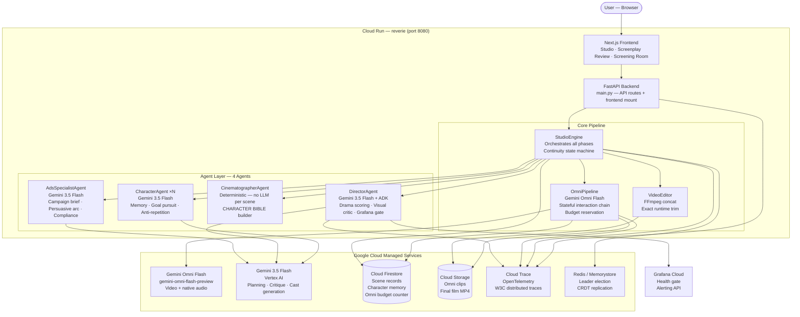

<h1 align="center">REVERIE — The First Living Film</h1>

<p align="center">
  <strong>Autonomous multi-agent AI platform that writes, acts, directs, and films stories in real-time.</strong><br/>
  <em>Google Cloud All Things Agentic Hackathon 2026 — Taskmaster Track</em>
</p>

<p align="center">
  <a href="https://cloud.google.com/run"></a>
  <a href="https://cloud.google.com"></a>
  <a href="https://ai.google.dev/gemini-api/docs/omni"></a>
  <a href="LICENSE"></a>
</p>

<p align="center">
  <a href="#-what-is-reverie">What Is REVERIE?</a> •
  <a href="#-live-demo">Live Demo</a> •
  <a href="#️-architecture">Architecture</a> •
  <a href="#-google-cloud-services">Google Cloud</a> •
  <a href="#-key-features">Features</a> •
  <a href="#-quick-start">Quick Start</a> •
  <a href="#️-deploy-to-cloud-run">Deploy</a>
</p>

---

## 🎬 What Is REVERIE?

**REVERIE** turns a single sentence into a complete AI film — autonomously, with no human direction.

You type a premise like *"A detective hunts a ghost in a rain-soaked 1940s city"*. REVERIE's agent pipeline takes over:

1. **Character agents** powered by Gemini 3.5 Flash think, speak, and act as real people — building memories, pursuing goals, and creating genuine dramatic conflict in a table read
2. **The Screenwriter** distills those living memories into an exact shot list locked to `ceil(runtime ÷ 10)` scenes before a single frame is generated
3. **The Cinematographer** freezes a CHARACTER BIBLE — precise physical descriptions for every cast member — placed at the top of every Omni prompt so faces and costumes stay consistent
4. **Gemini Omni Flash** renders each 10-second shot with native dialogue audio baked in, carrying the accepted `previous_interaction_id` as a stateful visual chain between shots
5. **The Director** watches every MP4 via Vertex AI multimodal, enforcing three acceptance thresholds before a clip joins the film
6. **FFmpeg** stitches accepted clips and trims the final shot so the advertised runtime is exact — not approximate

**Result:** One sentence → full film with native audio, verified continuity, and an evidence trail per shot.

---

## 🎥 Live Demo

> **► Deployed on Google Cloud Run** *(URL shared privately with judges)*
> **[► Watch Demo Video on YouTube](#)** *(link your 4-min demo video here)*

**Deployed to:** `gen-lang-client-0467881140` · Region: `us-east1` · Build: `37802503-70a4-46d3-9025-d6cd3248b8a5`

---

## 🏆 Taskmaster Track

### Automating the "Messy Chore" of Video Production

Professional video production requires: scriptwriting → casting → shot planning → video generation → audio sync → editing → final compile. That is a week of work for a human team. REVERIE automates all of it autonomously in one pipeline run.

| Workflow Stage | Manual Process | REVERIE Automation |
|---|---|---|
| **Casting** | Hire actors, write character bibles | `POST /generate_cast` → Gemini generates full cast with memories and visual descriptions |
| **Table Read** | Days of character workshopping | `CharacterAgent.tick()` — N agents simulate in parallel, building real memory |
| **Scriptwriting** | Weeks of drafts | `_generate_script_from_history()` → exact shot list from lived character memory |
| **Shot Planning** | Director of photography + storyboards | `CinematographerAgent.generate_omni_prompt()` — deterministic CHARACTER BIBLE per shot |
| **Video Generation** | Camera crew + location scouting | `OmniPipeline.generate_clip()` — Gemini Omni Flash, stateful chain |
| **Continuity Review** | Script supervisor per shot | `DirectorAgent.critique_scene()` — Vertex multimodal, three-threshold gate |
| **Final Edit** | Editing suite + colour grade | `VideoEditor.compile_movie()` — FFmpeg concat, exact runtime trim |

**REVERIE removes weeks of friction and produces a real deliverable autonomously** — a complete MP4 film with native audio, per-shot evidence, and an honest continuity record.

---

## 🏛️ Architecture

Full system design, data flows, sequence diagrams, and trust model: [`docs/ARCHITECTURE.md`](docs/ARCHITECTURE.md)



---

## ☁️ Google Cloud Services

Every integration is **live** — not mocked, not simulated.

| Service | SDK / Package | Role in REVERIE |
|---|---|---|
| **Gemini Omni Flash** | `google-genai>=2.6.0` | Renders every 10-second clip with native dialogue audio via `client.interactions.create`. Stateful chain via `previous_interaction_id`. |
| **Gemini 3.5 Flash** | `google-cloud-aiplatform` | Powers CharacterAgents (table read), Director (drama scoring + visual critique), Screenwriter, and Cast Generator |
| **Google ADK** | `google-cloud-aiplatform[adk]` | Wires DirectorAgent to Gemini with MCP tool bindings for Grafana Cloud health gate |
| **Vertex AI ADC** | Built-in | Authentication for all Gemini calls — no API key stored anywhere |
| **Cloud Firestore** | `google-cloud-firestore` | Persistent character memory, scene records, atomic Omni daily budget (`system_meta/omni_budget`) |
| **Cloud Storage (GCS)** | `google-cloud-storage` | Stores individual Omni clips and the final compiled film; delivers via public URL |
| **Cloud Run** | `cloudbuild.yaml` | Single-container deployment: FastAPI backend + Next.js frontend on port 8080 |
| **Cloud Build** | `cloudbuild.yaml` | Multi-stage Docker build → push → deploy pipeline |
| **OpenTelemetry → Cloud Trace** | `opentelemetry-exporter-gcp-trace` | Traces every agent decision, Omni call, and Director review with W3C trace context |

---

## ✨ Key Features

- **One-Line Premise → Full Film** — type a movie idea; AI generates cast, runs the table read, writes the script, renders every shot, and compiles the final film
- **Autonomous Multi-Agent Simulation** — N Character agents think and act independently each tick using Gemini 3.5 Flash; memories feed the Screenwriter
- **Gemini Omni Flash Video + Native Audio** — each 10-second shot is generated with character voices and ambient audio baked in — no separate TTS pipeline
- **Stateful `previous_interaction_id` Chain** — each accepted clip's Omni interaction ID is passed to the next call; when the parent is rejected, REVERIE retries unchained and marks the shot `CONTINUITY: PROMPT LEDGER ONLY` instead of claiming a chain it did not get
- **CHARACTER BIBLE at the Top of Every Prompt** — frozen physical descriptions anchor character identity before the action description; the Cinematographer is deterministic (no LLM call per scene)
- **Ads Specialist Agent** — `commercial` style routes planning through a dedicated agent: campaign brief (brand, audience, value proposition, CTA) → persuasive arc shot list → claim compliance pass
- **Director Visual Continuity Gate** — three independent thresholds: `continuity_score ≥ 0.78`, `identity_match ≥ 0.80`, `shot_adherence ≥ 0.72`; three modes: `enforce`, `advisory` (default), `off`
- **Editable Script Review** — every shot can be edited before rendering; per-shot image attachments for location plates and props
- **Exact-Runtime Final Film** — `ceil(runtime ÷ 10)` shots planned, every MP4 measured by `ffprobe`, last accepted clip trimmed by FFmpeg
- **Evidence-Rich Screening Room** — every shot shows: accepted/unverified/review-off, continuity score, Director critique, cast lock status, stateful chain verified flag, measured duration
- **Atomic Daily Budget** — Firestore counter reserves each Omni call before the API call is issued; retakes are separate reservations
- **Grafana Cloud Health Gate** — DirectorAgent checks Grafana alerting API before every Omni generation; throttles on active alerts
- **Enterprise-Grade** — leader election, crash recovery, budget throttling, OpenTelemetry tracing to Cloud Trace

---

## 🚀 Quick Start

### Prerequisites

| Tool | Version |
|---|---|
| Python | 3.11+ |
| Node.js | 20+ |
| FFmpeg + ffprobe | Latest |
| Google Cloud SDK | Latest |
| GCP project with Vertex AI, Firestore, Cloud Storage enabled | — |

### 1. Clone and configure

```bash
git clone https://github.com/Cholarajarp/REVERIE.git
cd REVERIE
cp .env.example .env
# Edit .env — fill in GOOGLE_CLOUD_PROJECT and GCS_RENDER_BUCKET
```

### 2. Authenticate

```bash
gcloud auth application-default login
gcloud config set project YOUR_PROJECT_ID
```

### 3. Backend

```bash
pip install -r requirements.txt
uvicorn main:app --host 0.0.0.0 --port 8000 --reload
```

### 4. Frontend

```bash
cd reverie-frontend
npm install
npm run dev
# Open http://localhost:3000
```

> **Note:** REVERIE has no mock or demo fallback. The render will fail visibly if `GCS_RENDER_BUCKET` or `GOOGLE_CLOUD_PROJECT` is missing, or if Vertex AI ADC is not configured. Confirm config with `GET /api/debug/omni_test`.

---

## ☁️ Deploy to Cloud Run

### One-Command Deploy

```bash
gcloud builds submit --config cloudbuild.yaml --project=YOUR_PROJECT_ID .
```

This builds a multi-stage Docker image (Node.js 20 + Python 3.11), pushes to Container Registry, and deploys to Cloud Run with 2 GB RAM / 2 CPU / max 1 instance. Authentication uses **Vertex AI ADC** — no API key required.

### Get your live URL

```bash
gcloud run services describe reverie \
  --region=us-east1 \
  --project=YOUR_PROJECT_ID \
  --format="value(status.url)"
```

### Manual deploy

```bash
docker build -t gcr.io/YOUR_PROJECT/reverie .
docker push gcr.io/YOUR_PROJECT/reverie

gcloud run deploy reverie \
  --image gcr.io/YOUR_PROJECT/reverie \
  --region us-east1 \
  --allow-unauthenticated \
  --memory 2Gi --cpu 2 \
  --set-env-vars="GOOGLE_CLOUD_PROJECT=YOUR_PROJECT,GCS_RENDER_BUCKET=your-bucket,\
OMNI_MODEL_ID=gemini-omni-flash-preview,OMNI_DAILY_CLIP_BUDGET=100,\
MAX_CONTINUITY_RETAKES_PER_FILM=4,ALLOW_PARTIAL_FILMS=true"
```

---

## 📁 Project Structure

```
reverie/
├── main.py                           # FastAPI app, API routes, frontend mount
├── agents/
│   ├── character_agent.py            # Gemini-powered autonomous character + memory + goal pursuit
│   ├── director_agent.py             # Five-axis drama scoring, visual continuity critic, Grafana gate
│   ├── cinematographer_agent.py      # CHARACTER BIBLE + deterministic Omni prompt (no LLM per scene)
│   ├── ads_agent.py                  # Ads Specialist: campaign brief → persuasive arc → compliance
│   └── factory.py                    # Dynamic character creation from config
├── core/
│   ├── studio_engine.py              # Screenplay → Omni stateful chain → Director gate → final edit
│   ├── omni_pipeline.py              # Gemini Omni Flash Interactions API, budget reservation
│   ├── video_editor.py               # FFmpeg concat, native audio preserved, target duration trim
│   ├── audience_sync.py              # CRDT WebSocket real-time audience feed
│   ├── redis_broadcaster.py          # Leader election + CRDT replication
│   ├── clients.py                    # Vertex AI client initialization
│   ├── config.py                     # Typed environment configuration
│   ├── logger.py                     # Structured logging + OpenTelemetry trace spans
│   ├── simulation_engine.py          # Legacy tick-based simulation (world state)
│   ├── tts_pipeline.py               # Cloud TTS (legacy; Omni has native audio)
│   └── veo_pipeline.py               # Veo pipeline (legacy; unused by studio path)
├── mcp_servers/
│   └── reality_mcp.py                # Custom MCP server for world-state injection
├── repositories/
│   ├── scene.py                      # Atomic Firestore Omni budget reservation
│   ├── character.py                  # Character state persistence
│   └── world.py                      # World state persistence
├── models/
│   └── schema.py                     # Pydantic V2: SceneRecord, CharacterState, WorldState
├── tests/                            # Pytest unit tests (no GCP credentials needed)
├── reverie-frontend/
│   └── src/app/
│       ├── page.tsx                  # Landing page
│       ├── studio/page.tsx           # Cast builder, reference lock, screenplay review
│       ├── screening/page.tsx        # Evidence-rich live render + review timeline
│       └── dashboard/page.tsx        # Live simulation dashboard
├── docs/
│   └── ARCHITECTURE.md               # Complete architecture, data flows, diagrams
├── Dockerfile                        # Multi-stage: Node.js 20 + Python 3.11
├── cloudbuild.yaml                   # Cloud Build → Cloud Run deploy pipeline
├── .env.example                      # Environment variable reference
└── requirements.txt                  # google-genai>=2.6.0,<3.0.0; google-cloud-aiplatform
```

---

## 🔧 Environment Variables

| Variable | Required | Default | Description |
|---|---|---|---|
| `GOOGLE_CLOUD_PROJECT` | ✅ | — | GCP Project ID. Auth via Vertex AI ADC — no API key. |
| `GCS_RENDER_BUCKET` | ✅ | — | GCS bucket for Omni clips and final film |
| `GOOGLE_CLOUD_LOCATION` | No | `global` | Location for Omni renders |
| `OMNI_MODEL_ID` | No | `gemini-omni-flash-preview` | Omni model for video generation |
| `OMNI_DAILY_CLIP_BUDGET` | No | `24` | Atomic cap on Omni calls per UTC day |
| `MAX_CONTINUITY_RETAKES_PER_FILM` | No | `4` | Maximum separately-budgeted retakes per film |
| `CONTINUITY_REVIEW_MODE` | No | `advisory` | `enforce` / `advisory` / `off` |
| `REQUIRE_CHARACTER_REFERENCES` | No | `false` | Reject renders unless every character has an image lock |
| `ALLOW_PARTIAL_FILMS` | No | `false` | Accept partial edit when some scenes fail Director review |
| `REDIS_URL` | No | — | Redis for multi-instance leader election |
| `GRAFANA_URL` | No | — | Grafana Cloud URL for health gate |
| `GRAFANA_API_KEY` | No | — | Grafana Cloud API key |
| `CORS_ORIGINS` | No | `http://localhost:3000` | Comma-separated frontend origins |

---

## 🧪 Running Tests

```bash
# Backend tests (no GCP credentials needed)
pip install -r requirements-dev.txt
pytest

# Frontend lint + build
cd reverie-frontend
npm run lint
npm run build
```

---

## ⚠️ Honest Capabilities and Limits

| Constraint | How REVERIE handles it |
|---|---|
| Omni clips max ~10 seconds | Shot contract is 10 seconds. `ffprobe` measures every returned MP4 and logs a warning outside `OMNI_MIN_CLIP_SECONDS`–`OMNI_MAX_CLIP_SECONDS`. Does not reject the clip. |
| Omni aspect ratio: 16:9 or 9:16 only | UI offers only these two. `reserve_omni_budget()` rejects any other value before the API call. |
| Character identity is probabilistic | IMAGE LOCK + stateful chain is the strongest available mechanism — not a guarantee. Each shot is labelled with how it was reviewed. `unverified` is never displayed as `approved`. |
| `previous_interaction_id` may be rejected | Fallback to unchained with cast-lock reference images. Shot is marked `CONTINUITY: PROMPT LEDGER ONLY`. |
| Omni is preview software | `gemini-omni-flash-preview` API contract may change. |

---

## 📖 Documentation

| Document | Description |
|---|---|
| [`docs/ARCHITECTURE.md`](docs/ARCHITECTURE.md) | Complete system architecture, agent design, data flows, trust model, Mermaid diagrams |
| [`README.md`](README.md) | This file — project overview, features, deploy guide |
| [`.env.example`](.env.example) | Full environment variable reference with comments |

---

## 📄 License

MIT License — see [LICENSE](LICENSE).

---

<p align="center">
  <strong>Built with 🎬 for the Google Cloud All Things Agentic Hackathon 2026 — Taskmaster Track</strong>
</p>
