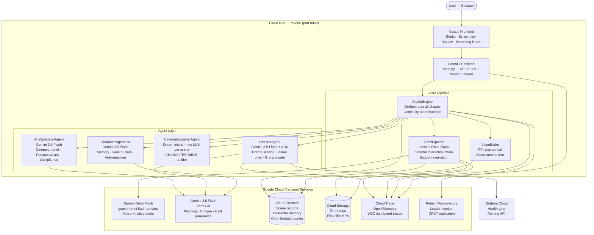
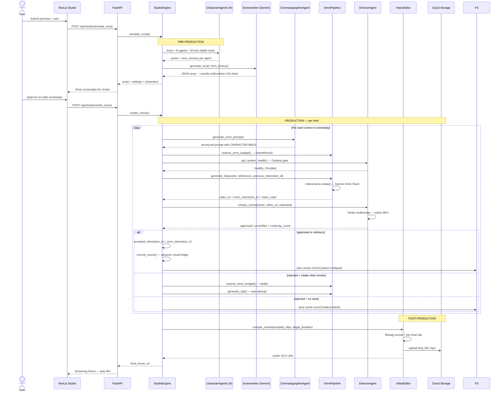
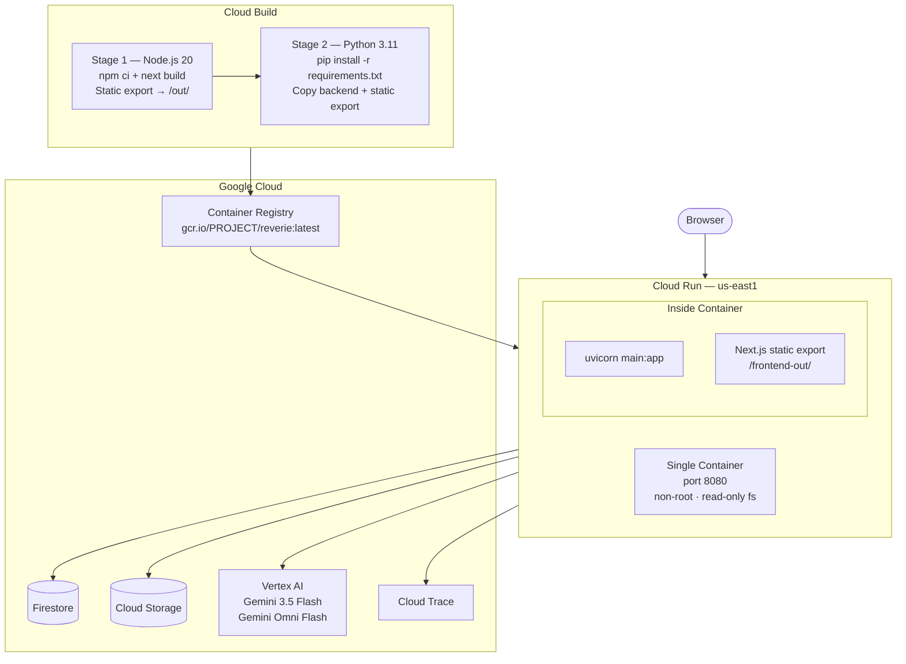

# REVERIE — System Architecture

> **Google Cloud All Things Agentic Hackathon 2026 — Taskmaster Track**
> Live deployment: shared privately with judges

---

## 1. Overview

REVERIE is an autonomous multi-agent AI pipeline that turns a single sentence premise into a complete film — no human direction required. It chains together four distinct agent stages, each implemented as a separate software component:

1. **Pre-Production** — Character agents simulate a table read; a screenwriter locks an exact shot list
2. **Shot Planning** — A deterministic Cinematographer builds a structured Omni prompt with a frozen CHARACTER BIBLE
3. **Video Generation** — Gemini Omni Flash renders each 10-second clip with native dialogue audio
4. **Continuity Gate** — The Director agent watches every MP4 via Vertex multimodal before it joins the film
5. **Post-Production** — FFmpeg stitches accepted clips and trims the final cut to the exact advertised runtime

Everything runs inside a single Cloud Run container serving both the FastAPI backend and the Next.js static frontend on port 8080.

---

## 2. Full System Context



---

## 3. Pipeline Sequence — One Film



---

## 4. Agent Design

### 4.1 CharacterAgent

**File:** [`agents/character_agent.py`](../agents/character_agent.py)

Each character runs as an independent agent instance with a private memory stream and goal. At every table-read tick, Gemini 3.5 Flash receives:

- Current world state (time, weather, location, co-present characters)
- Long-term goal
- Recent memory delta (newest 12 entries not yet in the context cache)
- Recent actions window (last 6 ticks) — enforces the anti-repetition rules

The model returns a structured JSON action with chain-of-thought keys placed **before** the decision keys — this is load-bearing: autoregressive generation means reasoning written first actually conditions the output.

**Anti-repetition system:** Four escalation axes — ESCALATE, REDIRECT, ACT, WITHDRAW — prevent the character from looping on the same line or action. The 6-entry window is replayed verbatim so the model has exact text to compare against.

**Goal discipline:** Three states — ADVANCING, BLOCKED, COMPLETE. A character may not abandon its long-term goal unless `goal_status = COMPLETE`.

### 4.2 DirectorAgent

**File:** [`agents/director_agent.py`](../agents/director_agent.py)

Two responsibilities:

**Drama detection** — five-axis tension scoring before the table read feeds the screenwriter:
| Axis | Weight | What it measures |
|---|---|---|
| Goal Collision | 0.30 | Two characters' goals that cannot both succeed |
| Proximity Under Pressure | 0.25 | Unresolved business + co-presence |
| Unresolved History | 0.20 | Open wounds, debts, secrets |
| Emotional Volatility | 0.15 | Incompatible moods |
| Irreversibility | 0.10 | Something about to become undoable |

Composite = `0.30A + 0.25B + 0.20C + 0.15D + 0.10E`. Filming threshold: ≥ 0.76.

**Visual continuity critic** — watches every Omni MP4 via `Part.from_uri(gs://)` on Vertex AI multimodal. Three independent acceptance thresholds:
- `continuity_score ≥ 0.78`
- `identity_match ≥ 0.80`
- `shot_adherence ≥ 0.72`

Three review modes controlled by `CONTINUITY_REVIEW_MODE`:
- `enforce` — clip joins the film only after the critic passes it
- `advisory` (default) — critic runs, unverified clips are kept but labelled
- `off` — no critic call, every shot labelled `review_disabled`

No mode ever labels a clip `director_approved` without a real verdict.

**Grafana health gate** — before every Omni generation, queries the Grafana Cloud alerting REST API. Returns `throttled` on active `service="reverie"` alerts, pausing the render with zero additional Omni spend.

### 4.3 CinematographerAgent

**File:** [`agents/cinematographer_agent.py`](../agents/cinematographer_agent.py)

Deterministic — **no LLM call per scene**. Builds the Omni prompt from structured data. Prompt order is intentional (Omni reads top-down):

1. **CHARACTER BIBLE** — frozen physical description for every character in the shot
2. **ENVIRONMENT** — time of day, weather, lighting inherited from the previous accepted scene
3. **PRIOR CONTEXT** — last 3 scene summaries for the prompt ledger
4. **SHOT** — drama beat, camera framing
5. **DIALOGUE** — spoken lines embedded as voice instructions
6. **STYLE** — visual language (`cinematic`, `anime`, `noir`, `documentary`, `commercial`)

Visual state (environment, character injuries/costume changes) is committed **only after the Director accepts a shot**. Rejected retakes never poison the accepted film chain.

**IP sanitisation** — known copyrighted character names and real-person references are replaced before any prompt is sent to Omni.

### 4.4 AdsSpecialistAgent

**File:** [`agents/ads_agent.py`](../agents/ads_agent.py)

Activated when `visual_style = "commercial"`. Replaces the drama screenwriter with a persuasion-focused planner:

1. **Campaign brief** — brand, target audience, single value proposition, call to action
2. **Persuasive arc shot list** — `hook → problem → product reveal → proof → CTA`
3. **Claim compliance pass** — verifies no unsubstantiated superlatives reach the final script

---

## 5. Core Pipeline Components

### 5.1 StudioEngine

**File:** [`core/studio_engine.py`](../core/studio_engine.py)

The central orchestrator. Manages two public phases:

**Phase 1 — `simulate_script()`**
- Validates cast, aspect ratio, and clip budget
- Runs the table read (`CharacterAgent.tick()` × N × M)
- Generates the exact shot list from lived character memory
- Returns the script for the user to review and optionally edit

**Phase 2 — `render_movie()`**
- Reserves GCS + Firestore for this render run
- Resolves character reference images (cast locks)
- Initialises the Cinematographer's CHARACTER BIBLE
- Iterates scenes: prompt → budget reserve → Grafana check → Omni → Director → accept/retake/fail
- Tracks `previous_accepted_interaction_id` — only advances on a real Director acceptance
- Calls the VideoEditor with the exact target runtime

**Continuity state machine per shot:**
```
reserve_budget
    → generate_prompt (Cinematographer)
    → generate_clip (OmniPipeline)
    → critique_scene (DirectorAgent)
    → if accepted: commit visual state, store interaction_id
    → if rejected + slots: retake (separate budget reservation)
    → if rejected + no slots: record failure
```

### 5.2 OmniPipeline

**File:** [`core/omni_pipeline.py`](../core/omni_pipeline.py)

Handles all communication with Gemini Omni Flash via the `google-genai` SDK.

**Stateful chain:** `client.interactions.create(model, input, previous_interaction_id)`. When the parent is rejected by the backend, retries unchained with the full cast-lock reference images still present — never drops the subject anchors on fallback.

**Budget reservation:** Atomic Firestore counter (`system_meta/omni_budget`) incremented before the API call. Retakes are separate reservations. One reservation = exactly one billable Omni call.

**Video extraction:** Handles two SDK response shapes — `output_video` (fast path) and `steps[type=model_output].content[type=video]` (primary path). Both inline `data` and Files API `uri` delivery are supported.

**Duration validation:** `ffprobe` measures every returned MP4. Out-of-range clips are logged as warnings, not rejected — discarding good video over a timing edge case wastes a billable generation.

### 5.3 VideoEditor

**File:** [`core/video_editor.py`](../core/video_editor.py)

FFmpeg-based final cut compiler:
- Builds a concat demuxer list from accepted clip URIs
- Downloads each MP4 from GCS
- Trims the **last accepted clip** to hit the exact `target_duration_seconds`
- Preserves Omni's native audio throughout — no re-encode
- Uploads final film to GCS and returns the public URL

---

## 6. Data Flows

### 6.1 Omni Budget — Atomic Reservation

```
StudioEngine.render_movie()
    │
    ├─ Check remaining_budget() → Firestore system_meta/omni_budget
    │   date == today? count < daily_limit? → proceed
    │
    ├─ For each scene:
    │   OmniPipeline.reserve_omni_budget()
    │   └─ Firestore transaction: increment count atomically
    │       └─ if count > limit → raise BudgetExceededError (no API call made)
    │
    └─ generate_clip() called only after reservation succeeds
```

### 6.2 Stateful Interaction Chain

```
Shot 1:  interactions.create(input=[ref_images + prompt])
         → returns interaction_id_1
         → Director approves
         → previous_accepted_interaction_id = interaction_id_1

Shot 2:  interactions.create(input=[prompt], previous_interaction_id=interaction_id_1)
         → Omni retains visual state from Shot 1
         → returns interaction_id_2
         → Director approves
         → previous_accepted_interaction_id = interaction_id_2

Shot 2 (retake):  Director rejects Shot 2 attempt 1
         → previous_accepted_interaction_id stays = interaction_id_1
         → retake uses interaction_id_1 as parent (not the rejected attempt)
         → rejected attempt never advances the chain
```

### 6.3 Scene Record Lifecycle

```
status = "queued"      → reserve_omni_budget() writes to Firestore
status = "rendering"   → generate_clip() starts
status = "failed"      → Omni API error OR Director rejection (all attempts exhausted)
status = "critiqued"   → Director accepted (approved or advisory unverified)

review_mode values:
  "director_approved"  → critic passed all three thresholds
  "unverified"         → advisory mode, clip kept but not approved
  "review_disabled"    → CONTINUITY_REVIEW_MODE=off
```

---

## 7. Deployment Architecture



**Key deployment properties:**
- Single port (8080) — FastAPI serves both API routes and the Next.js static export
- `min-instances: 0` — container sleeps when idle, zero cost at rest
- `max-instances: 1` — prevents runaway scaling and Gemini quota collisions
- `memory: 2Gi, cpu: 2` — headroom for concurrent Omni clip processing
- Authentication via **Vertex AI ADC** — no API key stored anywhere; the Cloud Run service account provides credentials automatically

---

## 8. Google Cloud Service Mapping

| Service | SDK | How REVERIE Uses It |
|---|---|---|
| **Gemini Omni Flash** | `google-genai>=2.6.0` | `client.interactions.create()` — renders 10-second clips with native audio; stateful chain via `previous_interaction_id` |
| **Gemini 3.5 Flash** | `google-cloud-aiplatform` | CharacterAgent ticks, DirectorAgent drama scoring + critique, Screenwriter, Cast Generator |
| **Google ADK** | `google-cloud-aiplatform[adk]` | `adk.Agent` in DirectorAgent — wires Gemini with MCP tool bindings |
| **Vertex AI ADC** | Built-in | All Gemini calls authenticated via service account — no API key in code or env |
| **Cloud Firestore** | `google-cloud-firestore` | Character memory, scene records, atomic Omni budget counter (`system_meta/omni_budget`) |
| **Cloud Storage** | `google-cloud-storage` | Omni clip storage (`renders/<scene_id>.mp4`), asset uploads (`assets/<id>.<ext>`), final film |
| **Cloud Run** | `gcloud run deploy` | Container hosting — API + frontend on port 8080 |
| **Cloud Build** | `cloudbuild.yaml` | Multi-stage Docker build + push + deploy pipeline |
| **OpenTelemetry → Cloud Trace** | `opentelemetry-exporter-gcp-trace` | W3C trace spans for every agent tick, Omni call, Director critique |

---

## 9. Security and Cost Controls

### Cost Safety
| Control | Mechanism |
|---|---|
| Atomic daily budget | Firestore transaction increments `system_meta/omni_budget` before every Omni call |
| Retake budget | `max_retries_per_film` env var caps how many additional reservations a single film can make |
| Max instances = 1 | Prevents multiple containers from competing on the same Gemini quota window |
| Grafana health gate | Pauses renders on active infrastructure alerts before spending a generation |
| `min-instances: 0` | Container sleeps when idle — no idle CPU/memory billing |

### No Secrets in Code
- All Gemini + Vertex calls use Vertex AI ADC (Cloud Run service account)
- No `GEMINI_API_KEY` in `cloudbuild.yaml` or container env vars
- GCS bucket access via the same service account identity

---

## 10. Development Environment

REVERIE was designed and built by a solo developer using **Google Antigravity IDE** — Google's agentic development platform (`antigravity.google`). 

The Antigravity IDE's agentic coding capabilities were used throughout the build:

| Capability Used | How It Helped |
|---|---|
| **Autonomous code generation** | Multi-agent architecture scaffolded across `agents/`, `core/`, `repositories/` |
| **Background subagents** | Parallel implementation of `OmniPipeline`, `StudioEngine`, `VideoEditor` as independent units |
| **Codebase understanding** | Deep context across 34 files — architectural decisions informed by full repo awareness |
| **Agentic iteration** | Continuity system design iterated against live Cloud Run deployments |
| **Artifact management** | Schema changes in `models/schema.py` propagated through the entire call chain |

This means REVERIE was built *with* an agentic platform *to build* an agentic platform — the development toolchain and the deliverable are from the same agent-first ecosystem.

---

## 11. Honest Limits

| Constraint | What REVERIE does |
|---|---|
| Omni has no duration control | `ffprobe` measures every returned MP4; warns if outside range; never rejects good video |
| Stateful chain may be rejected | Falls back unchained, keeps cast-lock reference images, marks shot `CONTINUITY: PROMPT LEDGER ONLY` |
| Character identity is probabilistic | Image lock + stateful chain is the strongest available mechanism — not a guarantee; every shot is labelled with how it was reviewed |
| Omni is preview software | `gemini-omni-flash-preview` API contract may change |
| Director critic may hit quota | Advisory mode keeps the clip and labels it `unverified` rather than failing the entire film on a quota blip |
